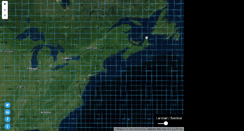
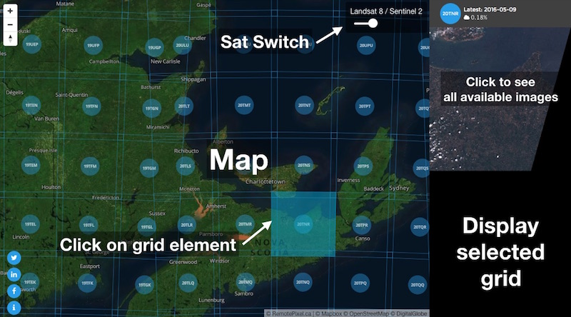
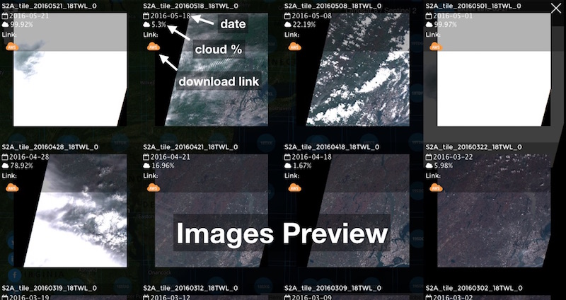

# Satellitesearch

###### Original blog post from RemotePixel.ca
###

Since the begining of RemotePixel adventure, I tried to build projects/app that I though were missing or were not user friendly to display, access or proccess satellite imagery. Speaking of remote sensing data access in general, Web interface are mostly old, not user friendly or both.

Alright, during the past year some of companies launched their own tool to access Landsat 8 data, and those were quite nice (e.g.: Libra by Development Seed). I could also mention planetLab and urthecast who are building really nice UX to access Landsat, Sentinel and their own data.

In the other hand, event if all those interfaces are really useful and game changers, I wanted to built my own portal to access not only Landsat 8 data but also Sentinel 2 data. so I started to think about a design that was as simple as possible.

###### User Interface

No filter philosophy: main idea for the UI, is to see what are the latest images over an area. Usualy, UI let you set filters (date or cloud) to see what are the available images, but I'm always like: what if even on a 70% cloudcover image I can see my area of interest.

###### See all available images

This UI is fully responsive and should display well on any screen.

This project won't exist without Mapbox and their studio/mapbox-gl API. Displaying and interacting with a grid of thousand of elements has never been as easy and fast.

I'd like to thanks Development Seed for their great tools library sat-utils that ease indexing, searching and processing of Landsat or Sentinel-2 data.
